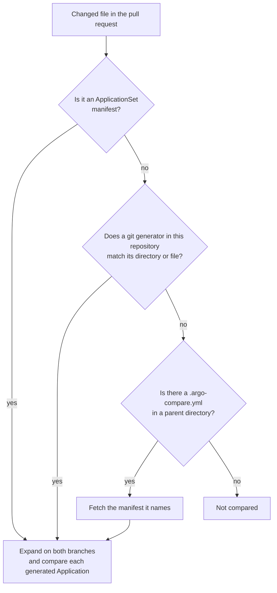
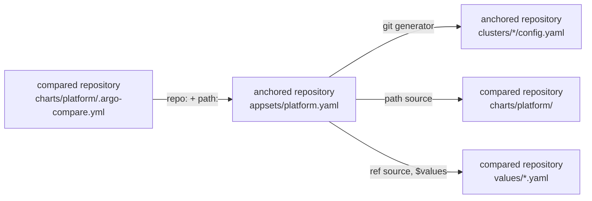
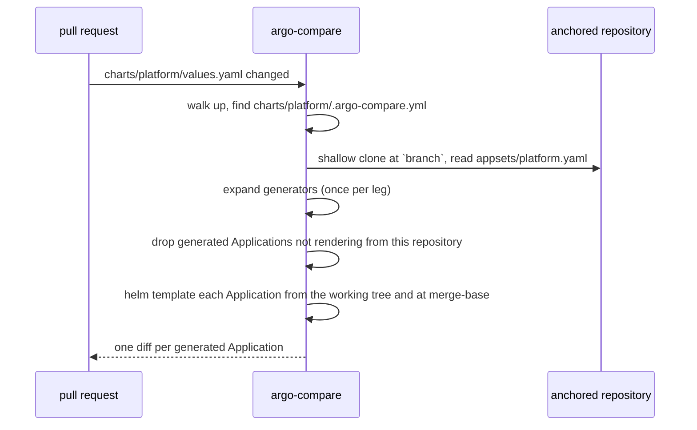

# Setting up ApplicationSets

This page tells you what to put where so a pull request reaches the
ApplicationSet it affects. The template engine, generator parameters and
limits are in [ApplicationSets](applicationsets.md); the anchor file schema is
in [Anchored repositories](anchored-repositories.md).

## The repositories involved

Up to three repositories take part. The rules below refer to them by these
names.

| Name | What it is | Which revision is read |
|---|---|---|
| **compared repository** | The one `argo-compare` runs in. Its `origin` remote is "this repository" everywhere below. | Two legs: your branch and the merge-base with the target branch. Generator input comes from the committed trees; charts and values render from the working tree. |
| **anchored repository** | The one a `.argo-compare.yml` names in `repo:`. | Once, at the tip of the anchor's `branch` (default: the remote's default branch). |
| **values repository** | Any other repository a `ref` source names. | A shallow clone at the source's `targetRevision`, which must be a branch or a tag. |

Most setups use one repository. A cross-repo anchor adds the second. A `ref`
source pointing at a third adds the last.

## How a change reaches an ApplicationSet

Three routes exist. A change that takes none of them is not compared, and
nothing is printed about it.



| Route | Fires when | Needs |
|---|---|---|
| Changed manifest | The ApplicationSet YAML is in the diff. | `goTemplate: true`. |
| Repository scan | A `directories` or `files` pattern of a git generator covers a changed path. Only generators reading this repository at `HEAD` or the target branch count. | `goTemplate: true`. A manifest without it is reported as unreadable during the scan. |
| Anchor | A `.argo-compare.yml` sits above the changed file. | The anchor. This is the usual route for chart or values changes, which generator patterns rarely cover, and the only route to an ApplicationSet in another repository. |

## Pick your layout

| Layout | Route | Anchor |
|---|---|---|
| [ApplicationSet and everything it reads in one repository](#1-one-repository) | changed manifest, repository scan | Only for chart or values directories. |
| [ApplicationSet in an apps repository, chart here](#2-applicationset-in-another-repository) | anchor with `repo:` | Required. |
| [Values-only changes through a `ref` source](#3-values-only-changes-through-a-ref-source) | anchor | Required, placed in the values directory. |

### 1. One repository

The ApplicationSet, its generator inputs and its charts all live in the
compared repository. [`examples/applicationset/`](../examples/applicationset)
has this shape, with a `list` generator alongside the `git` one.

```
.
├── apps/appset.yaml            # changed manifest route
├── clusters/                   # repository scan route
│   ├── dev/config.yaml
│   └── prod/config.yaml
└── charts/platform/
    ├── .argo-compare.yml       # anchor route: `application: {path: apps/appset.yaml}`
    ├── Chart.yaml
    └── values.yaml
```

What the manifest needs:

- `goTemplate: true`. Pair it with `goTemplateOptions: ["missingkey=error"]`.
- A git generator's `repoURL` is this repository's origin URL and its
  `revision` is `HEAD` or the target branch. A `list` generator has no such
  constraint.
- The template's `spec.source.repoURL` is this repository too. It is not
  checked on the changed-manifest and scan routes, but a `path` source always
  renders from the local tree, so a foreign URL would label this repository's
  content with another repository's name.

Editing the manifest, or adding a directory under `clusters/`, is picked up on
its own. Editing `charts/platform/values.yaml` is not: no generator pattern
covers it and the manifest did not change. The anchor in that directory is what
routes it. A chart shared by two ApplicationSets can be routed to only one,
because an anchor names one path.

An Application that only one branch generates is printed only with
`--print-added-manifests` or `--print-removed-manifests`.

### 2. ApplicationSet in another repository

The ApplicationSet lives in an apps repository together with its generator
inputs. The compared repository holds the chart and the values it renders.
[`examples/applicationset/cross-repo/`](../examples/applicationset/cross-repo)
is this layout.



The anchor, in every directory whose change should reach the ApplicationSet:

```yaml
# charts/platform/.argo-compare.yml
application:
  repo: https://git.example.com/platform/apps.git
  path: appsets/platform.yaml
  branch: main
```

Rules for the manifest in the anchored repository:

| Field | Allowed | Otherwise |
|---|---|---|
| git generator `repoURL` | The anchored repository, or the compared repository. Not both in one ApplicationSet, and never a third. | Hard error. |
| git generator `revision` | `HEAD`, or the branch the tree was read at: the anchor's `branch` for the anchored repository, the target branch for the compared one. | Hard error. |
| template `path` source `repoURL` | The compared repository. | The generated Application is skipped with the reason named. |
| template `chart` source (registry) | Compared only when a sibling `ref` source points at the compared repository. | Skipped with the reason named. |

If every generated Application is skipped, the run fails: an anchor is an
explicit pointer, so ignoring it would leave the change uncompared without a
word.

Which side the diff comes from depends on where the generator reads:

- **Generator reads the anchored repository.** Both legs generate the same set
  of Applications. The diff comes from the chart and values in the compared
  repository. Adding a cluster in the apps repository is not visible from here.
- **Generator reads the compared repository.** Each leg lists its own tree, so
  a directory the pull request adds or removes shows up as an added or removed
  Application.



The manifest is read once, at the anchor's branch tip. A pull request that
changes the chart layout and the Application's `valueFiles` at the same time is
out of sync until the apps-repository change lands. Land that one first.

Credentials for the clone come from `ARGO_COMPARE_GIT_TOKEN` and optionally
`ARGO_COMPARE_GIT_USERNAME`; they apply to `https://` anchors, while `ssh://`
anchors use the SSH agent. See
[Authenticating cross-repo clones](anchored-repositories.md#authenticating-cross-repo-clones)
for the per-host username table.

### 3. Values-only changes through a `ref` source

The template renders a chart from a registry or from this repository, and takes
its values from a sibling source declared with `ref:` and addressed as
`$values/...` in `helm.valueFiles`:

```yaml
sources:
  - repoURL: https://charts.example.com
    chart: platform
    targetRevision: 1.4.0
    helm:
      valueFiles:
        - '$values/values/{{ .cluster }}.yaml'
  - repoURL: https://git.example.com/platform/gitops.git   # the compared repository
    targetRevision: main
    ref: values
```

A pull request that changes only `values/prod.yaml` matches no generator
pattern, so the repository scan does not see it. Put a `.argo-compare.yml` in
the values directory pointing at the ApplicationSet, same-repo or cross-repo.
The registry chart is then compared because its values come from here.

When the `ref` source names the compared repository, each leg reads its own
revision of the file and the source's `targetRevision` is ignored. When it
names a values repository, the file comes from a clone at `targetRevision`.
`ARGO_COMPARE_GIT_TOKEN` is sent to that clone only when its URL has the same
scheme, host and port as `origin`; a values repository elsewhere must be
readable anonymously or use `ssh://`.

## Troubleshooting

`...` stands for the `unsupported Application configuration:` prefix every
manifest-level reason carries. Under an anchor a manifest-level reason fails
the run instead of skipping the manifest. A generated Application skipped for
its own source is only skipped; the run fails only when that leaves nothing to
compare.

| Message | Cause | Fix |
|---|---|---|
| No output at all after a chart or values change | No route matched. | Add a `.argo-compare.yml` above the changed file. |
| `Skipping unsupported application configuration [<file>]: ... only ApplicationSets with 'goTemplate: true' are supported` | Legacy templating. | Add `goTemplate: true`. |
| `Skipping unsupported application configuration [<file>]: ... generator "matrix" is not supported` (or `merge`, `clusters`, `scmProvider`, `pullRequest`) | The generator needs cluster or forge access. | Not supported. Plain Applications in the same diff are still compared. |
| `Skipping <file>: ... git generator repoURL "<url>" is not this repository ("<origin>"); only same-repository generators are supported` | A changed manifest whose generator reads a repository that is not checked out. The repository scan drops such a manifest silently. | Point it at this repository, or reach the ApplicationSet through a cross-repo anchor whose `repo:` is the repository the generator reads. |
| `... git generator repoURL "<url>" is not this repository ("<origin>"); no tree of it is available` | The same, under a same-repo anchor. A hard error. | As above. |
| `... git generator repoURL "<url>" is neither this repository ("<origin>") nor the anchored one ("<repo>")` | A third repository. | Not supported. |
| `... git generators read both this repository and the anchored one; only one repository per ApplicationSet is supported` | Mixed generators under one anchor. | Split them into two ApplicationSets. |
| `... git generator revision "<rev>" is neither HEAD nor the compared branch "<branch>"` (or `nor the anchored revision read`) | The generator pins a tag or another branch. | Set `revision: HEAD`. |
| `Skipping generated Application [<name>]: its source is a registry chart, which a change to this repository cannot affect` | The template renders a registry chart with no `ref` source pointing here. | Expected unless the values live here. If they do, declare a `ref` source for this repository and address it with `$values`. |
| `Skipping generated Application [<name>]: its source repository "<url>" is not this one, so this repository's tree cannot render it` | The template's `path` source belongs to another repository. | Expected. Only Applications rendering content from this repository are compared. |
| `anchored ApplicationSet <ref> generates no Application rendering a chart from this repository, so the change under the anchor is not covered by any comparison` | Every generated Application was skipped. | Check the template's `spec.source.repoURL`, or the anchor's `path`. |
| `Skipping added Application [<name>]; enable --print-added-manifests to render it` | Only your branch generates it. | Pass `--print-added-manifests`, or `--print-removed-manifests` for the mirror case. |
| `Skipping unreadable ApplicationSet manifest during discovery: <file> (<reason>)` | The repository scan found a manifest it cannot parse. | Fix the manifest; the reason names the field. |
| `valueFiles entry references an undeclared ref source` | `$name/...` with no source carrying `ref: name`. | Declare the `ref` source. |
| `values file is missing from ref source` | The `$values` path does not exist at the revision read, and the source does not set `helm.ignoreMissingValueFiles`. | Fix the path, or the `targetRevision` of a remote ref. Set `ignoreMissingValueFiles: true` if the file is genuinely optional. |
| `ref source <url> pins commit <sha>; a remote ref source must name a branch or a tag` | A commit SHA on a values repository. | Use a branch or a tag. |
| `ApplicationSet "<name>" generates duplicate Application name "<name>"` | Two generator elements render the same `metadata.name`. | Make the name template unique per element. |
