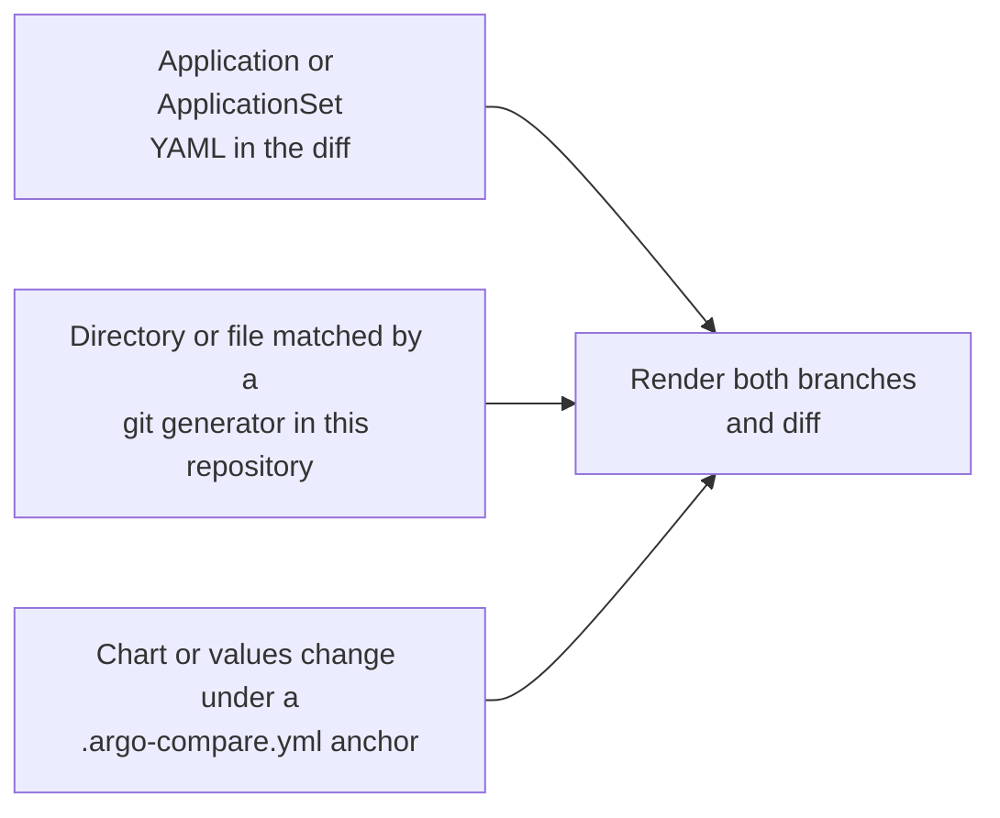

# How it works

1. `argo-compare` checks which Application files the source branch has modified since it diverged from the target branch (the merge-base is the baseline, so commits made only on the target branch after divergence are ignored). Files under a Helm chart's `templates/` directory (any directory containing `Chart.yaml`) are recognized as chart templates and skipped from this Application discovery — their `{{ }}` syntax is not valid YAML, so they are never parsed as manifests. This matters when charts live alongside cluster config in the same repo.
2. It fetches the content of the changed Application files from the target branch. A changed file that turns out to be an ApplicationSet is expanded into the Applications it generates on each branch, and those are matched by name and compared pair by pair; see [ApplicationSets](applicationsets.md).
3. For path-based sources, if `Chart.yaml` declares subchart dependencies, `helm dependency build` runs to populate `charts/` before rendering.
4. For a multi-source Application, `helm.valueFiles` entries written as `$name/path` are resolved against the sibling source declaring `ref: name` — from this repository when its `repoURL` is the local origin, otherwise from a shallow clone at its `targetRevision`.
5. It renders manifests using `helm template` against both source and target branch values, applying `spec.source.helm.parameters` and any `.argocd-source[-<appName>].yaml` override files committed next to the chart (the files argo-watcher / Argo CD Image Updater write for image tag bumps).
6. It strips Helm-injected labels since they are not meaningful for the comparison (skip with `--preserve-helm-labels`).
7. Optionally, when `--validate-manifests` is enabled, all source-branch rendered manifests (not just changed ones) are validated against Kubernetes schemas via `kubeconform`. See [Manifest validation](manifest-validation.md).
8. Finally, it compares the rendered manifests from the source and target branches and prints the difference.

Step 1 is one of three entry paths. They differ only in how the manifest is found; rendering and diffing are shared.

The second and third paths are described in [Setting up ApplicationSets](applicationset-setup.md) and [Anchored repositories](anchored-repositories.md).
